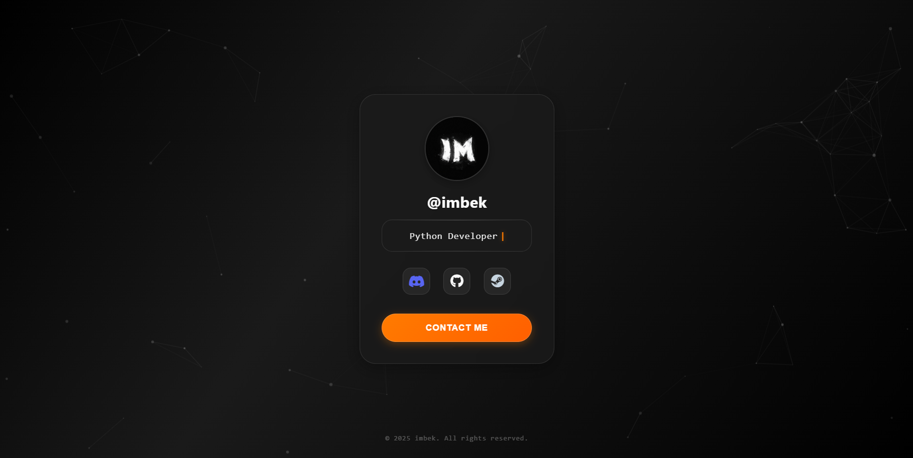

# Profile Card - @imbek

 <!-- Замените placeholder.png на реальный скриншот или GIF вашего сайта! -->

## 🌟 Обзор

Это интерактивная визитная карточка (profile card) созданная с использованием HTML, CSS и JavaScript. Она демонстрирует различные современные веб-технологии и анимации для создания привлекательного пользовательского интерфейса.

## ✨ Особенности

*   **3D Tilt Effect:** Карточка реагирует на движение мыши, создавая эффект наклона в 3D-пространстве.
*   **Animated Typing:** Динамически печатающийся текст, отображающий роли и навыки пользователя (Python Developer, Node.js Developer и т.д.).
*   **Particle Background:** Анимированный фон с интерактивными частицами (на основе particles.js).
*   **Interactive Button:** Кнопка "Contact Me" с эффектом частиц при клике и анимацией загрузки перед переходом по ссылке.
*   **Glassmorphism Design:** Элементы дизайна с эффектом матового стекла.
*   **Animated Icons:** Плавные эффекты при наведении на социальные иконки (Discord, GitHub, Steam).
*   **Responsive Structure (Базовая):** Основная структура должна адаптироваться к разным экранам (хотя фокус был на десктопной версии).
*   **Entry Animation:** Плавное последовательное появление элементов карточки при загрузке страницы.

## 🛠️ Технологии

*   **HTML5:** Структура страницы.
*   **CSS3:** Стилизация, анимации, 3D-трансформации, Flexbox.
*   **JavaScript (ES6):** Логика 3D-наклона, анимация печати, эффект частиц на кнопке, анимация загрузки кнопки.
*   **[particles.js](https://github.com/VincentGarreau/particles.js/):** Библиотека для создания анимированного фона с частицами.
*   **[Font Awesome](https://fontawesome.com/):** Иконки социальных сетей.

## 🚀 Как запустить локально

1.  Клонируйте репозиторий:
    ```bash
    git clone https://github.com/ваш-юзернейм/ваш-репозиторий.git
    ```
2.  Перейдите в папку проекта:
    ```bash
    cd ваш-репозиторий
    ```
3.  Откройте файл `index.html` в вашем веб-браузере.

Никаких дополнительных зависимостей или шагов сборки не требуется.

## ⚙️ Кастомизация

*   **Информация профиля:** Измените имя пользователя (`@imbek`), ссылки на социальные сети (Discord, GitHub, Steam) и изображение профиля (`profile.jpg`) в файле `index.html`.
*   **Печатающийся текст:** Отредактируйте массив `texts` в JavaScript-секции файла `index.html`, чтобы изменить отображаемые роли/навыки.
*   **Метаданные:** Обновите метаданные (description, keywords, Open Graph URL/image) в `<head>` файла `index.html`, особенно если вы размещаете сайт на хостинге.
*   **Стили:** Цвета, шрифты, анимации и другие визуальные аспекты можно настроить в файле `styles.css`.

## 📄 Лицензия

Этот проект распространяется под лицензией MIT. Смотрите файл `LICENSE` для подробностей.

---

Создано с ❤️ @imbek
